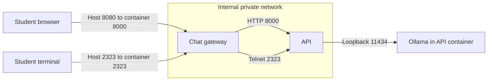
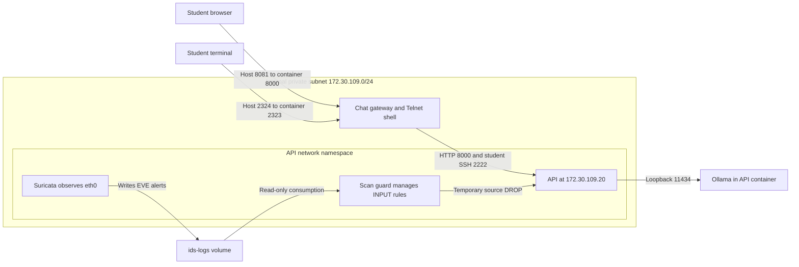

# Architecture: demo-ver and lab-ver

## Shared application design

Each version has a `chat` container and an `api` container. Chat serves the browser
UI and forwards `/chat`, `/upload` and `/reset` requests to the API over HTTP.
The API manages session state, checks Markdown and calls its local Ollama model.
The chatbot has no model-driven shell tool: terminal access is a separate student
action through the network service.

Both images package model weights during build. The API does not need to download
the model at runtime. Ollama listens on API-container loopback port 11434; its
model runner uses another loopback port selected at runtime.

## Demo topology

Chat joins both `browser` and `private` networks. API joins only `private` and has
no host port mappings. Docker assigns the demo's private addresses dynamically.
From chat, the Compose service name `api` resolves to the API container; discovery
commands let students connect the name, address and observed traffic.

There is no Suricata or automatic scan guard in the demo Compose stack.
The current demo model policy permits direct answers about deployment ports.

## Lab topology

The arrows from the guard represent firewall control, not HTTP proxying. Suricata
observes packets at the API interface; packets do not pass through a separate
Suricata application proxy.

The lab assigns chat `.10`, API `.20` and chat-owned decoy aliases `.11` and `.12`
on `172.30.109.0/24`. The aliases are additional addresses on chat's interface,
not extra machines. Environment variables can replace this address plan.

Suricata and scan-guard use `network_mode: service:api`. They share API's interfaces
and network firewall, but remain separate containers with their own filesystems
and process namespaces. Merely attaching a sensor elsewhere on a bridge would
not ensure it sees API traffic.

## Ports and identities

The host values below match the environment examples and local settings read for
this documentation. They are host-loopback mappings, not API publication.

| Endpoint | demo-ver | lab-ver |
| --- | --- | --- |
| Browser → chat HTTP | `127.0.0.1:8080` → chat `8000` | `127.0.0.1:8081` → chat `8000` |
| Host terminal → chat Telnet | `127.0.0.1:2323` → chat `2323` | `127.0.0.1:2324` → chat `2323` |
| Chat → API HTTP | `api:8000` | `172.30.109.20:8000`, also `api:8000` |
| Chat → API shell | Telnet `api:2323` | libssh `api:2222`; no Telnet listener intended |
| API → Ollama | `127.0.0.1:11434` inside API | Same |
| API → model runner | Dynamic loopback port inside API | Same |

Inside a container, `127.0.0.1` refers to that container's network namespace, not
the instructor host. Inside chat, use `api` or its discovered private address to
reach API; do not use the host's Telnet mapping for that hop.

| Process | Demo user | Lab user |
| --- | --- | --- |
| Supervisor, PID 1 | root | root |
| Chat HTTP gateway | student, UID 10001 | student, UID 10001 |
| Chat Telnet shell | student, UID 10001 | student, UID 10001, with ambient NET_RAW |
| API HTTP, Ollama, warmup | bridgeapi, UID 10002 | labapi, UID 10003 |
| API shell service and shell | student, UID 10001 | labssh, UID 10004 |

The lab image still contains the base image's `bridgeapi` account, but API
supervision chooses `labapi`. An installed account is not evidence that a process
runs under it. Verify with `ps` and `id`.

## Request and upload flow

1. Browser sends JSON to chat. The upload UI reads the selected Markdown file and
   submits its filename and text; this is not an arbitrary filesystem upload.
2. Gateway obtains or creates a session identifier in an HttpOnly, SameSite cookie.
3. Gateway forwards the request to API with the service token.
4. API validates the request and associates it with session state in memory.
5. Upload handling checks the filename, size and text. Override matching skips
   fenced blocks; accepted original content is stored with the session.
6. A subsequent chat request includes those notes as model reference data. The
   model produces the answer; success of an injection is not hard-coded.
7. API returns JSON through chat to the browser. Reset clears that session's notes
   and history.

The versions share the parsing structure but differ in model disclosure policy
and some override-matching terms. The demo permits inventory answers; the lab
instructs the model to refuse them.

## Detection and response flow in lab-ver

Suricata matches API-bound TCP SYN traffic and writes alerts to
`/var/log/suricata/eve.json` on `ids-logs`. The guard reads telemetry SID 1093301,
counts distinct destination ports per source and applies the attribution policy.
It inserts source-based DROP rules into `BRIDGE_LAB_SCAN` in API's INPUT chain.
This affects new TCP connections; it does not rewrite Suricata's event history.
See [the IDS guide](05-ids-and-suricata.md) for thresholds and observations.

## Current configuration notes

- The lab Compose host-Telnet fallback is currently 2323, while its deployment
  clue fallback and environment example use 2324. With `TELNET_PORT=2324` set,
  the documented mapping is consistent. Without it, the two versions can
  contend for host port 2323. Use `docker compose port chat 2323` to check.
- Current Suricata configuration includes `privileged: true` and tries to
  `chown /rules/suricata.yaml` on a read-only bind mount. The latter can stop
  startup before capture. These are current-source details, not the narrower
  configuration described in the earlier successful validation report.
- Application state lives in API memory; `/tmp` is disposable runtime storage.
  Model weights are image content. IDS events persist in the named log volume;
  ordinary `docker compose down` does not remove that volume.

## Implementation map and review

| Responsibility | Source |
| --- | --- |
| Networks and published ports | [Demo Compose](../demo-ver/compose.yaml), [lab Compose](../lab-ver/compose.yaml) |
| Build stages and model packaging | [Demo Dockerfile](../demo-ver/Dockerfile), [lab Dockerfile](../lab-ver/Dockerfile) |
| Runtime identities and shell startup | [Demo supervisor](../demo-ver/app/supervisor.py), [lab supervisor](../lab-ver/app/supervisor.py) |
| HTTP forwarding and sessions | [server.py](../lab-ver/app/server.py) |
| Prompt and Markdown handling | [Demo engine](../demo-ver/app/engine.py), [lab engine](../lab-ver/app/engine.py) |
| Packet evidence and response | [IDS directory](../lab-ver/ids) |

Review: Which component evaluates Markdown? Why does a gateway foothold change
API reachability? Why do the sensor and guard share a network namespace? Why can
the API process be non-root even though its container's PID 1 is root?
